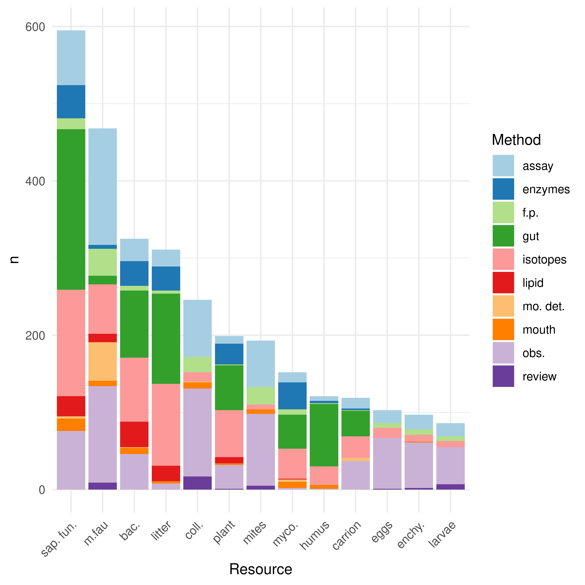

# Trophic resources of the edaphic microarthropods: a worldwide review of the empirical evidence

[Short title]{.ul}: Trophic resources of the edaphic microarthropods

 Víctor Nicolás Velazco^1,2^, Carlos Eduardo Coviella^1,2^, Liliana
 Beatriz Falco^1,2^, Leonardo Ariel Saravia^3,4^

 ^1^ Departamento de Ciencias Básicas, Universidad Nacional de Luján
 (Argentina), ^2^ Instituto de Ecología y Desarrollo Sustentable (UNLu
 -- CONICET), ^3^ Instituto de Ciencias, Universidad Nacional de
 General Sarmiento (Argentina) ^4^ Centro Austral de Investigaciones
 Científicas (CADIC-CONICET), Ushuaia, Argentina.

 Corresponding author:

 Dr. Leonardo A. Saravia

 [lsaravia@campus.ungs.edu.ar]{.ul}

 Universidad Nacional de General Sarmiento

 J.M. Gutierrez 1159 (1613) Los Polvorines

 Buenos Aires Argentina

 Author contributions: LF and LS originally formulated the idea, NV, CC
 developed the methodology, NV, CC, LF, and LS analyzed the data and
 wrote the manuscript.

## Abstract

Ecosystem sustainable use requires reliable information about its biotic and abiotic structure and functioning. Accurate knowledge of trophic relations is central for the understanding of ecosystem dynamics, which in turn, is essential for food web stability analyzes and the development of sustainable practices. There is a rapid growth in the knowledge on how belowground biodiversity regulates the structure and functioning of terrestrial ecosystems. Although, the available information about trophic relationships is hard to find and fragmented. This gathering the information available worldwide about the food resources of soil mesofauna. From the 3105 hits of the initial search on food resources of soil microarthropods, only a total of 196 published works related particular species, genera, and families to particular trophic resources, the majority of them dealing with soils of the Palearctic region. From the 196 publications we extracted 3009 records relating specific taxonomic groups to their trophic resources, 20% mention saprophytic fungi as a food resource, 16% cite microfauna, 11% mention bacteria, 10% litter and 5% cite Mycorrhizal fungi. The available information was highly skewed, the 73.71% comes from Acari, and within these, 50.62% correspond just to Sarcoptiformes. For Collembola, the literature is scarce, the majority coming from Arthropleona. This review highlights the general lack of information relating species, genera, and families of the soil mesofauna to specific trophic resources. It also highlights that available research mostly comes from European sites, with the use of trophic resources by the mesofauna of the majority of the soils in other parts of the world still largely unknown.

 **Keywords**: food web; trophic ecology; soil mesofauna; Acari;
 Collembola

## Introduction 

 Only in the last few decades, sustainable use of the soil has come
 sharply into focus. The report on Global Biodiversity and Ecosystem Services (IPBES, 2019),
 and the recent State of Knowledge of Soil Biodiversity (FAO, 2020)
 clearly state the importance of the soil ecosystem and the central
 role that soil biodiversity plays on ecosystem services. However,
 critical information is lacking on edaphic biodiversity and
 interaction webs for most soils.

 The view about the edaphic biota has changed in recent years. Much of
 the work on taxonomic descriptions, richness, biodiversity estimation,
 and microenvironments (Anderson, 1978; Petersen and Luxton, 1982),
 highlights the fragility and need for the conservation of soils, and
 soil biodiversity (FAO, 2020; Walker, 1992). The focus has gradually
 shifted towards the study of the functioning of the soil ecosystem, in
 which the interactions between the biota and the edaphic environment
 hierarchically affect its structure and functioning, regulating the
 functioning of the edaphic ecosystem. (Barrios, 2007; Behan-Pelletier
 and Newton, 1999; Brussaard, 1997; Lavelle et al., 2006). The
 relationships of species richness with ecosystem dynamics allow
 establishing causal relationships between the characteristics of the
 organisms present and the processes and services of the ecosystem
 (Hooper et al., 2005; Martín-López et al., 2007) in natural as well as
 in managed environments. (Wall et al., 2012).

 The soil mesofauna is mainly constituted by microarthropods belonging
 to the Subclasses Acari and Collembola (following Kranz and Walter,
 2009; Hopkin 2007) that inhabit the upper soil horizons (Martinez and
 Narciso, 2009), where complex communities are developed and
 maintained. These communities are influenced by a high microhabitat
 heterogeneity and the number of food resources available (Anderson,
 1977, 1978; Lavelle and Spain, 1994), which provide a wide and varied
 set of ecological niches (Nielsen et al., 2010; Wallwork, 1958). The
 mesofauna, through its trophic relationships, contributes to the
 edaphic functioning through the fragmentation of organic matter, the
 nutrient cycle dynamics, the transport of microflora propagules, and
 the regulation of microflora and microfauna populations that affect
 primary production. (Brussaard, 1997; Cragg and Bardgett, 2001;
 Lavelle, 1996; Wall et al., 2012; FAO, 2020).

 Studies on the flow of energy and matter in the soil ecosystem, group
 edaphic organisms into functional guilds to understand the
 relationships between soil biota structure and ecosystem functioning.
 However, this approach leaves aside the understanding of how changes
 in the community influence the ecosystem's functioning (Thompson et
 al., 2012; Wall and Moore, 1999). Thompson et. al. (2012) suggests
 addressing this problem from the point of view of the trophic
 networks, which could link the flow of matter and energy and the
 diversity of a community. Thus, by studying the structure of the
 trophic networks, we can better understand the role of biodiversity in
 the functioning of the ecosystem.

 Knowing the resources that microarthropod groups use for food is
 difficult due to their size and cryptic environment. The recognition
 of the food resources that are part of the diet of soil
 microarthropods must be based on empirical evidence, which constitutes
 the first step to establish the interactions between trophic species
 and the trophic resources that describe the food webs. (Briand and
 Cohen, 1984; van Straalen, 1998; Walter et al., 1991).

 The information about trophic relationships of the different taxonomic
 groups is still quite scarce. These data are necessary to build and
 analyze webs of interactions that, in turn, could be used to assess
 the stability and conservation status of these ecosystems. (Barrios,
 2007; Briones, 2014; Thakur et al., 2020).

 This review gathers the information currently available regarding the
 use of trophic resources by the edaphic microarthropods. This
 information, together with other characteristic features of the soil
 microarthropods, will allow building a food web interactions network,
 that could result in a better understanding of the structure and
 functioning of the edaphic biota (FAO, 2020). Trophic networks will,
 in turn, allow for comparing the state of different soils, or the same
 soils under different intensities of anthropic impact (Thompson et
 al., 2012).

 The empirical characterization of trophic interactions is challenging
 due to the spatial and temporal complexity of feeding patterns, and
 the limitations of the methods to identify and quantify the components
 of the diet (Nielsen et al., 2018; Pankhurst et al., 1997; Walter et
 al.,1991).

 Thus, the objectives of this review are: 1- to gather all the
 information currently available regarding the trophic resources used
 by soil microarthropods, 2- to describe the known trophic
 relationships and potential diets of these soil microarthropods at the
 family taxonomic level or lower, and 3- to establish the current
 status of knowledge, skews in the available information.

## Materials and methods 

### Empirical evidence

The empirical evidence provided through studies carried out under  <!-- Esto es un comentario -->
 laboratory conditions (A) can be based on **observations** of the 
 feeding behavior of the animals under study, on studying **food
 preferences,** or **tests** to study other interactions or biological
 phenomena related to diet, in general, the tests they are made using
 microcosm (Saur and Ponge 1988; Hubert, Žilová, and Pekár 2001;
 Schneider 2005; Schneider and Maraun 2009). The observation of the
 **intestinal content** (B) is based on considering that what is found
 in the tract is evidence of what is actually consumed (Jacot in 1936;
 Hartenstein 1962; Schneider et al. 2004; John A. Wallwork 1958a) this
 method requires the preparation of specimens for observation by
 microscopy techniques. The morphology and functioning of the
 **mouthparts** (C) are related to the manipulation, acquisition, and
 processing that microarthropods carry out on food and could be used to
 determine trophic guilds (Buryn and Brandl 1992; Kaneko 1988;
 Macnamara 1924; Poole 1958). This evidence also requires microscopy
 techniques to obtain information.

 **Molecular** tools (D), such as barcoding, could be used to determine
 the presence of a species or a taxonomic group within the intestinal
 tract and it allows for establishing trophic relationships or other
 types of interactions. (Heidemann et al. 2014; King et al. 2008; Read
 et al. 2006). The study of **digestive enzymes** (E) in invertebrates
 can explain the digested food portions (Siepel and Ruiter-Dijkman
 1993; Berg, Stoffer, and Van Den Heuvel 2004), those enzymes that
 hydrolyze structural polysaccharides are related to the diet (Nielsen
 1962) and allow the differentiation of trophic guilds (Berg, Stoffer,
 and Van Den Heuvel 2004; Siepel and Ruiter-Dijkman 1993).

 The use of the natural variation of **stable isotopes** (F) as
 empirical evidence of the use of trophic resources is based on the
 study of isotopic signatures; the isotopic signature of δ15N informs
 about the trophic level of the invertebrate and that of δ13C will
 indicate the proportion of trophic resources consumed, but the
 potential trophic resources need to be chosen previously to the
 isotopic analysis. (Tiunov 2007; Maraun et al. 2011; Potapov, Tiunov,
 and Scheu 2019; Potapov et al. 2019) also, the potential of this tool
 is such that inferences can even be made about the metabolic pathways
 of biomolecules (Pollierer et. Al. 2019, Pollierer & Scheu 2021;
 Chamberlain et. Al. 2006).

 Finally, the study of the **lipid profile** (G) is based on using the
 fatty acids of the tissue of the resources as biological markers
 through the identification of fatty acids in the animal, since it or
 cannot synthesize them (absolute markers) or their synthesis supposes
 a high metabolic cost (relative markers) (Kühn, Schweitzer, and Ruess
 2019; Ruess and Chamberlain 2010; Sechi et al. 2014; Paul M.
 Chamberlain and Black 2005; Pollierer, Scheu, and Haubert 2010).

 General review publications are also included in this review, provided
 that they collect information on the use of trophic resources from
 publications not readily available.

### Bibliography search

 A systematic search for empirical evidence that relates the use of at
 least one trophic resource by soil microarthropods is the strategy
 used to address this issue. For them, we relied on publications whose
 keywords relate to the taxonomic groups of interest, trophic
 relationships, and methods that provide evidence of consumption. From
 these keywords, we formulated search strings applied to scientific
 bibliography in both Scopus and Google Scholar database search
 engines.

 We used the following search string in Scopus:

 "ALL((microarthropods OR springtails OR mites OR oribatida OR
 mesostigmata OR prostigmata OR astigmata) AND (trophic OR diet OR
 feeding) AND soil AND (\"gut content\" OR \"stable isotope\" OR \"food
 preference\" OR \"fatty acid\" OR lipids OR metabarcoding) AND (family
 OR genus OR species)) AND (LIMIT-TO (SUBJAREA, \"AGRI\") OR LIMIT-TO
 (SUBJAREA, \"ENVI\") OR LIMIT-TO (SUBJAREA, \"MULT\") OR LIMIT-TO
 (SUBJAREA, \"EART\")) AND (LIMIT-TO (EXACTKEYWORD, \"Collembola\") OR
 LIMIT-TO (EXACTKEYWORD, \"Acari\") OR LIMIT-TO (EXACTKEYWORD, \"Soil
 Fauna\")) AND (LIMIT-TO (LANGUAGE, \"English\") OR LIMIT-TO (LANGUAGE,
 \"Spanish\"))", which returned 838 titles (September 3, 2021).

 For searching in Google Scholar we used:

 "(microarthropods OR springtails OR mites) AND (\"oribatida\" OR
 \"mesostigmata\" OR \"prostigmata\" OR \"astigmata\") AND (trophic OR
 diet OR feeding) AND soil AND (\"gut content\" OR \"stable isotope\"
 OR \"food preference\" OR \"fatty acid\" OR metabarcoding)". This
 search returned 2170 titles (September 3, 2021).

 We made additional searches from reviews and books resulting in 97
 more titles.

 The first eligibility criterion to reduce the number of records was to
 select those papers whose titles or abstracts relate soil
 microarthropods to trophic resources (425 titles). From these, we
 selected those papers that effectively mention families, genera, or
 species of soil mites and springtails, relating them with at least one
 trophic resource. This resulted in 196 publications, which can be
 consulted in Electronic Supplementary Material I (ESM I). All the
 microarthropods recorded in the 196 publications cited can be found in
 ESM II, which is cross-referenced with ESM I. A flow diagram of the
 bibliography search and selection procedure is also provided as ESM
 III.

### Database construction

The empirical evidence provides information on the trophic relationships of these animals in different ways: some publications relate the taxa to food items and others group them into guilds or trophic categories. To deal with this heterogeneity, it was necessary to define the trophic resources (Table 1) that summarize their trophic and ecological characteristics in the edaphic ecosystem (Berg & McClaugherty 2008; Clark 1971; Warcup 1971; Ponge 1991; Persson et al. 1980; Krantz et al. 2009; Chernova et al. 2007; Rusek 1998; Schneider et. Al. 2005).

We associate taxa and those resources, so that: a) if the publication indicated a food item it was assigned to a trophic resource in which it is defined, 
b) or if the taxa are grouped in some guild or trophic category, then each taxon was assigned the typical resources consumed by that category.

Based on this allocation strategy, we developed a database presented in Supplementary material II. The taxonomic information and the trophic resources were obtained from the different sections of the publications and their appendices (Thakur et al., 2020). In a complementary way, each taxon found has all the classification levels according to Krantz 2009 and Hopkin 2007, for mites and springtails respectively. The database is also available in the github repository <https://github.com/EcoComplex/TrophicResources> and Zenodo <https://zenodo.org/record/XXXXXXX>.

### Data analysis

 The records were then analyzed by counting the associations between
 the taxa, the methods used and the trophic resources identified. We
 identified trophic resources, the number of records, and their
 relationships with the different taxonomic levels. Then, the breakdown
 of each taxon was carried out within the taxonomic categories and
 their relationship with trophic resources. We calculated the
 proportions of the different methods and their relationship with the
 taxonomic level and trophic resources.

 Finally, we estimated the potential importance of resources on the
 diet for the main orders of mites (Arachnida) and springtails
 (Collembola) using the proportion of mentions between trophic
 resources and taxa included in such orders. For example, if a species
 has ten records on the consumption of the same trophic resource, the
 selection of this food item is likely a reflection of the use of the
 resource. Then if we gathered the information available from different
 species of the same genus, and the food items consumed by them, then
 we could assign it to the potential diet for the genus. Similarly, the
 resource use of the genera within a family can be thought of as
 reflecting the potential diet of the family.

 That is, the diet of higher taxonomic hierarchies will be constituted
 by the sum of the resources used by the lower taxonomic levels.

 The calculations, graphs, and tables were prepared using Microsoft
 Excel and R Statistical software version 4.1.2 (R Core Team 2021), the source code is available at Github <https://github.com/EcoComplex/TrophicResources> and Zenodo <https://zenodo.org/record/XXXXXXX>..

## Results

 From the 3105 papers initially recovered with the searches, 196 papers
 were found to meet our criteria (see ESM III). A total of 133 articles
 from the 196 selected publications (ESM I) mention the countries in
 which the studies were carried out. Of these, 1 article belongs to the
 Ethiopian region, 3 to the Neotropical region, 3 to the Oriental
 region, 7 to the Australian region, 34 to the Nearctic region, 75 are
 all located in the Palearctic region, and the remaining 10 are from
 the Antarctic region. (Figure 1). This is important to highlight
 because the species strongly vary depending on the biogeographic
 region. There are 106 publications mentioning the environments in
 which the studies were conducted; from these 59 were temperate
 forests, 3 tropical forests, 21 grasslands, 23 agroecosystems, and 11
 deserts.

 {width="5.0in"eight="2.51n"}

We obtained a total of 3015 records on trophic relationships (ESM II), with Acari contributing 2218 records (73.57%), and within this number, the majority (50.86%) corresponds to Sarcoptiformes. According to the taxonomic resolution, data of 170 species, 30 genera and 2 families of Collembola and 412 species, 131 genera and 49 families of Acari were obtained.

### Methods used for trophic resources identification

#### Methods for resource assignment

 The method of observations in laboratory tests provides the main
 empirical evidence from the database with 706 records (Figure 2).

![Methods used in the literature to assign trophic resources to soil mesofauna taxa. Colors within columns refer to the number of different taxonomic levels for which each method assigned at least one resource. Assay: laboratory tests and observations. Isotopes: stable isotopes. Gut: intestinal content. Enzymes: Digestive enzymes. Mouth: mouthparts morphology. Lipid: lipid profile. Mo. det: molecular detection of intestinal content, f.p.: Food preference assays. Obs.: direct lab observations of feeding activity. Reviews: general reviews by other authors.](figures/Metodo_ByTaxLevel.png){width="4.14in"
 height="4.in"}

 Microarthropods at the family level constitute 9.3% of the
 observations in laboratory tests, with 63.6% of the total
 corresponding to the Prostigmata suborder, within which 10 different
 families are mentioned. The evidence offered by observations in
 laboratory tests adds up to 90.7% for species and genera. The orders
 Mesostigmata (62.5%), Sarcoptiformes (23.8%), Trombidiformes (9%) and
 Arthropleona (4%) are the ones with the higher presence in the
 literature.

 The gut content method reaches 21.3% of the records, in which the
 species taxonomic level corresponds to 89.9% of the total records and
 the genus level to 9.5%.

 Stable isotopes follow in importance. From these, 76.9% of the records
 mention species. Genera and family add up to 23.1% of the records.

 The activity of digestive enzymes (178 records) in all cases reports
 down to the species level. For this empirical evidence, the authors
 worked with the order Sarcoptiforme (Acari) with 38 different species
 and Arthropleona and Symphypleona (Collembola) with 17 different
 species.

 Other three methods accumulate 9.75% of the records, these being food
 preference tests (131 records), the study of fatty acids (99 records),
 and the use of mouthpart structures (64 records).

 Intestinal contents analyses with molecular techniques for the
 detection of DNA is a tool of recent development and represent 2% of
 the total records.

#### Resources identified by empirical evidence

 The main resource mentioned corresponds to saprophytic fungi (19.7%)
 followed by microfauna (15.6%), bacteria (10.8%), and litter (10.3%),
 the records for mites, collembola, enchytraeidae, larvae, and eggs
 accumulate 725 mentions (24%) (Table 1). It is worth noting that a
 higher number of records have been taken to the species level. For
 instance, 592 trophic records are associated with saprophytic fungi
 consumption, of which 16 were associated with the taxonomic level of
 the family, 105 to the genus level, and 474 to the species level.

{width="5.7in" height="5.in"}

 Laboratory observations (the most used method), mention the use of the
 thirteen trophic resources (Figure 3) in which the order of importance
 according to the number of mentions is microfauna \> springtails \>
 mites \> saprophytic fungi \> invertebrate eggs \> enchytraeids \>
 larvae of invertebrates that accumulate 82.3%. For this empirical
 method, the main resources correspond to typical resources of
 predatory animals except for saprophytic fungi, the main taxa
 mentioned is Mesostigmata. The stacked bars (Figure 3) show the different proportions in which the methods provide evidence of the use of a resource, if the contribution of each method is considered according to the number of citations in the bibliography, they are counted in decreasing order: direct observations (706 records) > intestinal content (639) > isotopes (591) > laboratory tests (503) > enzymes (178) > food preference tests (131 records). 

 The methodologies that use laboratory studies, i.e. laboratory tests,
 laboratory observations, and food preference tests, provide direct
 evidence of the use of the trophic resources, constituting together
 44.5% of the empirical evidence analyzed. (ESM II) These laboratory
 methods are the ones that most frequently mention the use of animal
 resources, springtails - mites - invertebrate larvae - invertebrate
 eggs - enchytraeids, as food resources. These methods rarely mention
 the consumption of Mycorrhizal fungi and rarely the use of humus.

### Use of trophic resources by soil microarthropods

 It is interesting to note that at the family level, the most numerous
 records correspond to trophic resources such as springtail, mites,
 microfauna, larvae, invertebrate eggs, and enchytraeids, typical
 resources of predatory microarthropods (Table 2). Similarly, at the
 genus level, the typical resources of predators represent 54% of the
 records. At the species level, the main resource mentioned is
 saprophytic fungi.

 The use of trophic resources in the six main orders mentioned in the
 literature (3 orders of Collembola and 3 orders of Acari) are divided
 into their families, genera, and species in a nested way (Table 2).
 For example, for the order Symphypleona (Sy), the empirical evidence
 studies 13 species included in 10 genera within 3 families. In this
 way, Table 2 shows also for Symphypleona (Sy), that 8 of the 13
 species mentioned, within 7 of the 10 genera, within 2 of the 3
 families in the available bibliography, are mentioned consuming
 Saprophytic fungi. For additional identity and information on
 families, genera and species see ESM II.

 In all the taxonomic hierarchies considered, the order Sarcoptiformes
 (Acari) consumes mainly saprophytic fungi, bacteria, litter, plant
 tissues, and Mycorrhizal fungi. The order Trombidiformes (Acari), are
 presented mainly as predators.

 For Collembola, the diversity of species addressed by empirical
 evidence is grouped into only 13 families, 3 of which belong to
 Symphypleona and a family of Neelipleona.

The empirical evidence that addresses the trophic study of Arthropleona (Collembola) is represented by 154 different species, these were mainly associated with saprophytic fungi (119 species), followed in importance by bacteria, litter and humus. The microfauna is mentioned as a resource for 39 species.

{width="5.4in"
 height="3.6in"}

 Figure 4 presents the proportion of resources used by the main 3 mite
 orders and 3 Collembola orders, as found in the literature. For
 instance, the resource of saprophytic fungi is the main constituent of
 the diet of the Arthropleona, being the bacteria, the litter, the
 humus, and the microfauna mentioned resources in lesser proportion.
 Trombidiformes have a diet based mainly on microarthropods and
 nematodes and to a lesser extent saprophytic fungi and bacteria.

## Discussion

 Until the 1960s, soil fauna was considered mainly earthworms, and
 terrestrial ecologists considered most of the soil fauna as a "black
 box" of decomposers and detritivores (Briones, 2014). The information
 gradually collected over the following decades regarding the edaphic
 microarthropods is reaching the point where it is possible to focus on
 integrative works. (Pautasso 2013) However, the available information
 is still scarce and mostly restricted to the most numerous or
 conspicuous groups of the soil microarthropods, mainly from European
 soils.

 For soil microarthropods, the evidence provided by laboratory work
 results in the most straightforward traditional method to know how
 these animals use trophic resources, their feeding behavior, their
 food preferences, and their development and growth in controlled
 environments, but Feeding links observed in the laboratory do not
 necessarily relevant for the field (Nielsen 2018, Potapov 2022). The
 method used to relate the isotopic signature of organisms and their
 resources is a recently developed tool that is useful for detecting
 the importance and the changes in time or space of assumed trophic
 relationships, which means that we have to know in advance if the
 trophic relationship exists. The main drawback of the method is that
 if we erroneously assign a trophic relationship the proportions of the
 diets could be greatly distorted from the real trophic relationships.
 On the other side, this method has several advantages 1) it can
 analyze a large number of species and an important variety of
 resources (Potapov et al., 2019), 2) it can provide field evidence of
 real interactions

 3\) it can provide quantitative data, accounting for interaction
 strength

 4\) it can provide information on assimilation and not only ingestion
 (Nielsen et al. 2018)

 The different methods have different sources of errors so it will be
 desirable that trophic resources used by soil microarthropods can be
 determined in a complementary way with several methods (Potapov et
 al., 2020; Walter et al.,1991).

 The most used resources are saprophytic fungi, microfauna, and
 bacteria. If we associate them with their nutritional characteristics,
 these trophic resources are rich in molecules with great nutritional
 value as determined in the dietary routes labeled by fatty acids,
 stable isotopes, or the enzymatic methods (Nielsen, 1962; Potapov et
 al., 2019; Ruess and Chamberlain, 2010).

 It is also to be noted that the information available for Acari and
 Collembola is strongly asymmetric, corresponding mainly to the order Sarcoptiformes in Acari and to Arthropleona in Collembola.

 Despite the increasing amount of descriptive works and lists of
 taxonomic groups, the information available worldwide is still largely
 fragmentary and incomplete, and taxonomic resolution varies
 considerably between and within published works.

 We found that a large proportion of the resources are defined as
 taxonomic categories of species, genera, and families, which would be
 important to estimate the diets of higher taxonomic groups. The
 available information for low taxonomic levels could be used as a
 reference to address the problem of what the use of soil resources
 will be like by higher-level taxonomic groups (Bedano, 2007; Potapov
 et al. 2020).

However, this information must be interpreted with caution, because within a taxonomic category each species could apply different strategies when exploiting food resources (Lavelle and Spain, 2001; Moore et al., 1988), although the taxa treated here are considered generalist consumers, recently the term "choosy generalist" was suggested as the behavior that characterizes consumers that inhabit soils (Potapov et al. 2022)

 The results presented here provide valuable new information about the
 different feeding strategies of the main groups of the soil
 microarthropods, and also on the quality and usefulness of the
 different methods used to assign trophic resource use to different
 taxa. It also presents the current status of knowledge about soil
 microarthropods trophic resources usage. Moreover, it highlights the
 still quite scant information available in this regard.

 Finally, it is necessary to call attention to the need for more
 studies on the trophic relationships of the soil microarthropods. Out
 of a total of approximately 9000 described species of Collembola
 (Bellinger et al., 2020), it was only possible to find trophic
 information for just 127 soil inhabitant species. For Acari, out of
 the approximately 58,000 species described (Schmidt, 2020), it was
 only possible to find references of trophic relationships for 307 soil
 species.

 It is clear that big gaps in the available information must be filled
 to advance our knowledge on the structure and functioning of soil food
 webs. Not only are there several microarthropods groups hardly
 explored, but also the geographical coverage is still quite narrow.
 Almost 52% of the published studies about the trophic resources of
 Acari and Collembola were developed in European countries. Further
 deepening on the knowledge of functional and trophic relationships of
 the soil the fauna would allow for a better and more precise
 evaluation of the functioning of the edaphic ecosystem, the protection
 of the ecosystem services that the soil microarthropods provide, and
 the sustainable use of the soil.

## Acknowledgements

 The authors wish to thank the help of Dr. Fernando Momo for his useful
 comments to previous versions of this work. To Dr. Mark Breidenbaugh
 for his help in reviewing the English language usage and grammar.

## Declarations

 This work was partially funded by a scholarship to Victor N. Velazco
 from Consejo Nacional de Ciencia y Tecnología (CONICET). This research
 did not receive any other specific grant from funding agencies in the
 public, commercial, or not-for-profit sectors. The authors declare no
 conflicts of interest. All the data for this work not shown here are
 available as Electronic Supplementary Material and referred to in the
 text when appropriate.

 **Conflict of Interest:** The authors declare they have no conflict of
 interest.

## Bibliography

 Anderson JM., 1978. A method to quantify soil-microhabitat complexity
 and its application to a study of soil animal species diversity. Soil
 Biol. Biochem. 10, 77--78.
 https://doi.org/10.1016/0038-0717(78)90014-7

 Anderson JM., 1977. The Organization of Soil Animal Communities. Ecol.
 Bull. 25, 15--23.

 Barrios E., 2007. Soil biota, ecosystem services, and land
 productivity. Ecol. Econ. 64, 269--285.
 https://doi.org/10.1016/j.ecolecon.2007.03.004

 Bedano JC., 2007.El rol de la mesofauna edáfica en la evaluación de la
 calidad del Suelo, In: De La Biología de Los Suelos a La Agricultura.
 Universidad Nacional de Río Cuarto. pp. 247--258.

 Behan-Pelletier V, Newton G., 1999. Linking soil biodiversity and
 ecosystem function. The taxonomic dilemma. BioScience 2.
 [[https://doi.org/10.2307/1313540]](https://doi.org/10.2307/1313540).

 Bellinger PF, Christiansen KA, Janssens F., 2020. Internet resource
 available from:
 [[http://www.collembola.org]](http://www.collembola.org/). Last
 updated: November 30, 2020. Last accessed: December 23, 2020.

 Berg, M.P., Stoffer, M., van den Heuvel, H. 2004. Feeding guilds in
 Collembola based on digestive enzymes. Pedobiologia 48, 589-601. DOI:
 [[\10.1016/j.pedobi.2004.07.006]](http://dx.doi.org/10.1016%2Fj.pedobi.2004.07.006)

 Berg B, McClaugherty C., 2008. Plant litter: decomposition, humus
 formation, carbon sequestration, 2nd. ed. Springer, Berlin.

 Briand F, Cohen JE., 1984 Community food webs have scale-invariant
 structure. Nature, Letters to Nature. 307, 264--267.

 Briones MJI., 2014. Soil fauna and soil functions: a jigsaw puzzle.
 Front. Environ. Sci. 2, 1--22.
 <https://doi.org/10.3389/fenvs.2014.00007>

 Brussaard L., 1977. Biodiversity and Ecosystem Functioning in Soil.
 Ambio. 26, 563--570.

 Buryn R, Brandl R., 1992. Are the morphometrics of chelicerae
 correlated with diet in mesostigmatid mites (Acari)? Exp. Appl.
 Acarol. 14, 67--82.
 [[https://doi.org/10.1007/BF01205353]](https://doi.org/10.1007/BF01205353)

 Chamberlain, P. M., Bull, I. D., Black, H. I. J., Ineson, P., &
 Evershed, R. P. (2006). Collembolan trophic preferences determined
 using fatty acid distributions and compound-specific stable carbon
 isotope values. Soil Biology and Biochemistry, 38(6), 1275-1281.

 Chernova NM, Bokova AI, Varshav EV, Goloshchapova NP, Savenkova YuYu.,
 2007. Zoophagy in Collembola. Entomol. Rev. 87, 799--811.
 https://doi.org/10.1134/S0013873807070020

 Clark FE., 1971. Bacterias del Suelo, In: Burges, A., Raw, F. (Eds.),
 Biología del Suelo, Chapter 2. Ediciones Omega, Barcelona. pp. 27--68.

 Cragg RG, Bardgett RD., 2001. How changes in soil faunal diversity and
 composition within a trophic group influence decomposition processes.
 Soil Biol. Biochem. 33, 2073--2081.
 https://doi.org/10.1016/S0038-0717(01)00138-9

 FAO, ITPS, GSBI, SCBD, EC., 2020. State of knowledge of soil
 biodiversity. Status, challenges and potentialities, Report 2020;
 Rome, FAO. https://doi.org/10.4060/cb1928en

 Hartenstein R., 1962. Soil Oribatei. I. Feeding Specificity among
 Forest Soil Oribatei (Acarina). Ann. Entomol. Soc. Am. 55, 202--206.
 https://doi.org/10.1093/aesa/55.2.202

 Hättenschwiler S, Tiunov AV, Scheu, S., 2005. Biodiversity and Litter
 Decomposition in Terrestrial Ecosystems. Annu. Rev. Ecol. Evol. Syst.
 36, 191--218. https://doi.org/10.1146/annurev.ecolsys.36.112904.151932

 Heidemann K, Ruess L, Scheu S, Maraun M., 2014. Nematode consumption
 by mite communities varies in different forest microhabitats as
 indicated by molecular gut content analysis. Exp. Appl. Acarol. 64,
 49--60. https://doi.org/10.1007/s10493-014-9807-x

 Hooper DU, Chapin FS, Ewel JJ, Hector A, Inchausti P, Lavorel S,
 Lawton JH, Lodge DM, Loreau M, Naeem S, Schmid B, La HS, Symstad AJ,
 Vandermeer J, Wardle DA., 2005. Effects of biodiversity on ecosystem
 functioning: A consensus of current knowledge. Ecol. Monogr. 75, 33.
 [[https://doi.org/10.1890/04-0922]](https://doi.org/10.1890/04-0922)

 Hopkin, S. P. (1997). Biology of the springtails: (Insecta:
 Collembola). Oxford University Press. Oxford, UK. 340 pp.

 Hubert J, Žilová M, Pekár, S., 2001. Feeding preferences and gut
 contents of three panphytophagous oribatid mites (Acari: Oribatida).
 Eur. J. Soil Biol. 37, 197--208.
 https://doi.org/10.1016/S1164-5563(01)01083-4

 International Commission on Zoological Nomenclature. Internet
 resource. iczn.org, last accessed: September 13, 2021.

 IPBES, 2019. Global assessment report on biodiversity and ecosystem
 services of the Intergovernmental Science-Policy Platform on
 Biodiversity and Ecosystem Services. Brondizio ES, Settele J, Díaz S,
 Ngo HT (eds). IPBES secretariat, Bonn, Germany.

 Kaneko N., 1988. Feeding habits and cheliceral size of oribatid mites
 in cool temperate forest soils in Japan. Rev. Écologie Biol. Sol. 25,
 353--363.

 King RA, Read DS, Traugott M, Symondson WOC., 2008. Molecular analysis
 of predation: A review of best practice for DNA-based approaches. Mol.
 Ecol. 17, 947--963. https://doi.org/10.1111/j.1365-294X.2007.03613.x

 Krantz GW, Walter DE (Eds.), 2009. A manual of acarology, 3rd ed.
 Texas Tech University Press, Lubbock, Texas.

 Kühn J, Schweitzer K, Ruess L., 2019. Diversity and specificity of
 lipid patterns in basal soil food web resources. PLOS ONE 14,
 e0221102. https://doi.org/10.1371/journal.pone.0221102

 Lavelle P., 1996. Diversity of soil fauna and ecosystem function.
 Biol. International 33, 3--16.

 Lavelle P, Decaëns T, Aubert M, Barot S, Blouin M, Bureau F, Margerie
 P, Mora P, Rossi JP., 2006. Soil invertebrates and ecosystem services.
 Eur. J. Soil Biol. 2006; 42, S3--S15.
 https://doi.org/10.1016/j.ejsobi.2006.10.002

 Lavelle P, Spain AV., 2001. Soil Ecology, 2nd. ed. Kluwer Academic
 Publisher. Springer.

 Martínez PA, Narciso EN., 2009. Mesofauna. In: Momo, F.R., Falco, L.B.
 (Eds.), Biología y Ecología de la Fauna del Suelo. Imago Mundi, Buenos
 Aires, p. 186.

 Martín-López, B, González JA, Díaz S, Castro I, García-Llorente M.,
 2007. Biodiversidad y bienestar humano: el papel de la diversidad
 funcional. Ecosistemas. 16, 69--80.

 Moore JC, Walter, DE, Hunt, HW., 1988. Arthropod Regulation of Micro-
 and Mesobiota in Below-Ground Detrital Food Webs. Annu. Rev. Entomol.
 33, 419--435. https://doi.org/10.1146/annurev.en.33.010188.002223

 Nielsen CO., 1962. Carbohydrases in Soil and Litter Invertebrates.
 Oikos. 13, 200--2015. https://doi.org/10.2307/3565085

 Nielsen JM, Clare EL, Hayden B, Brett MT, Kratina P., 2018. Diet
 tracing in ecology: Method comparison and selection. Methods Ecol.
 Evol. 9, 278--291. https://doi.org/10.1111/2041-210X.12869

 Nielsen UN, Osler GHR, Campbell CD, Neilson R, Burslem DFRP, van der
 Wal R., 2010. The Enigma of Soil Animal Species Diversity Revisited:
 The Role of Small-Scale Heterogeneity. PLoS ONE. 5, e11567.
 https://doi.org/10.1371/journal.pone.0011567

 Pankhurst C., Doube BM, Gupta VVSR., 1997. Biological Indicators of
 Soil Health. CAB INTERNATIONAL.

 Persson T, Bååth E, Clarholm M, Lundkvist H, Söderström BE, Sohlenius
 B., 1980. Trophic Structure, Biomass Dynamics and Carbon Metabolism of
 Soil Organisms in a Scots Pine Forest. Ecol. Bull. 32, 419--459.

 Petersen H, Luxton, MA., 1982. Comparative Analysis of Soil Fauna
 Populations and Their Role in Decomposition Processes. Oikos. 39, 288.
 https://doi.org/10.2307/3544689

 Pey B, Nahmani J, Auclerc A, Capowiez Y, Cluzeau D, Cortet J, Decaëns
 T, Deharveng L, Dubs F, Joimel S, Briard C, Grumiaux F, Laporte MA,
 Pasquet A, Pelosi C, Pernin C, Ponge JF, Salmon S, Santorufo L, Hedde
 M., 2014. Current use of and future needs for soil invertebrate
 functional traits in community ecology. Basic Appl. Ecol. 15,
 194--206.
 [[https://doi.org/10.1016/j.baae.2014.03.007]](https://doi.org/10.1016/j.baae.2014.03.007).

 Pautasso, M. (2013). Ten simple rules for writing a literature review.
 *PLoS computational biology*, *9*(7), e1003149.

 Pollierer MM, Scheu S, Haubert D., 2010. Taking it to the next level:
 Trophic transfer of marker fatty acids from basal resource to
 predators. Soil Biol. Biochem. 42, 919--925.
 [[https://doi.org/10.1016/j.soilbio.2010.02.008]](https://doi.org/10.1016/j.soilbio.2010.02.008)

 Pollierer, M. M., & Scheu, S. (2021). Stable isotopes of amino acids
 indicate that soil decomposer microarthropods predominantly feed on
 saprotrophic fungi. *Ecosphere*, *12*(3), e03425.

 Pollierer, M. M., Larsen, T., Potapov, A., Brückner, A., Heethoff, M.,
 Dyckmans, J., & Scheu, S. (2019). Compound specific isotope analysis
 of amino acids as a new tool to uncover trophic chains in soil food
 webs. Ecological Monographs, 89(4), e01384.

 Ponge JF., 1991. Food resources and diets of soil animals in a small
 area of Scots pine litter. Geoderma. 49, 33--62.
 <https://doi.org/10.1016/0016-7061(91)90090-G>

 Potapov AM, Beaulieu F, Birrkhofer K, Bluhm SL, Degtyarev MI, Devetter M, Goncharov AA, Gongalsky KB, Klarner B, Korobushkin DI, Liebke DF, Maraun M, Mc Donnell RJ, Pollierer MM, Schaefer I, Shrubovych J, Semenyuk I I, Sendra A, Tuma J, Tůmová M, Vassilieva AB, Chen T, Geisen S, Schmidt O, Tiunov AV, Scheu S. 2022. Feeding habits and multifunctional classification of soil-associated consumers from protists to vertebrates. Biological Reviews <https://doi.org/10.1111/brv.12832>

 Potapov AM, Pollierer MM, Salmon S, Šustr V, Chen TW., 2020.
 Multidimensional trophic niche approach: gut content, digestive
 enzymes, fatty acids, and stable isotopes in Collembola. bioRxiv
 2020.05.15.098228.
 [[https://doi.org/10.1101/2020.05.15.098228]](https://doi.org/10.1101/2020.05.15.098228)

 Potapov AM, Tiunov AV, Scheu S., 2019. Uncovering trophic positions
 and food resources of soil animals using bulk natural stable isotope
 composition: Stable isotopes in soil food web studies. Biol. Rev. 94,
 37--59. [https://doi.org/10.1111/brv.12434]

 R Core Team (2021). R: A language and environment for statistical
 computing. R Foundation for Statistical Computing, Vienna, Austria.
 https://www.R-project.org/.

 Read DS, Sheppard SK, Bruford MW, Glen DM, Symondson WOC., 2006.
 Molecular detection of predation by soil micro-arthropods on
 nematodes. Mol. Ecol. 15, 1963--1972.
 https://doi.org/10.1111/j.1365-294X.2006.02901.x

 Ruess L, Chamberlain PM., 2010. The fat that matters: Soil food web
 analysis using fatty acids and their carbon stable isotope signature.
 Soil Biol. Biochem. 42, 1898--1910.
 https://doi.org/10.1016/j.soilbio.2010.07.020

 Ruess L, Schütz K, Migge-Kleian S, Häggblom MM, Kandeler E, Scheu S.,
 2007. Lipid composition of Collembola and their food resources in
 deciduous forest stands---Implications for feeding strategies. Soil
 Biol. Biochem. 39, 1990--2000.
 https://doi.org/10.1016/j.soilbio.2007.03.002

 Rusek J., 1998. Biodiversity of Collembola and their functional role
 in the ecosystem. Biodivers. Conserv. 7, 1207--1219.
 https://doi.org/10.1023/A:1008887817883

 Saur É, Ponge J., 1988. Alimentary studies on the Collembolan
 Paratullbergia callipygos using transmission electron microscopy.
 Pedobiologia. 31, 355--379.

 Schmidt KH., 2020. Internet resource available from:
 [[http://miteresearch.org]](http://miteresearch.org/). Last
 accessed: December 23, 2020.

 Schneider K., 2005. Feeding biology and diversity of oribatid mites
 (Oribatida, Acari). PhD dissertation. Technischen Universität
 Darmstadt. Available from:
 https://tuprints.ulb.tu-darmstadt.de/585/1/Dissertation_Schneider.pdf.

 Schneider K, Maraun M., 2009. Top-down control of soil microarthropods
 - Evidence from a laboratory experiment. Soil Biol. Biochem. 41,
 170--175. https://doi.org/10.1016/j.soilbio.2008.10.013

 Schneider K, Renker C, Maraun M., 2005. Oribatid mite (Acari,
 Oribatida) feeding on ectomycorrhizal fungi. Mycorrhiza. 16, 67--72.
 https://doi.org/10.1007/s00572-005-0015-8.

 Schneider K, Renker C, Scheu S, Maraun M., 2004. Feeding biology of
 oribatid mites: a minireview. Phytophaga. 14, 247--256.

 Siepel H, Ruiter-Dijkman EM., 1993. Feeding guilds of oribatid mites
 based on their carbohydrase activities. Soil Biol. Biochem. 25,
 1491--1497. https://doi.org/10.1016/0038-0717(93)90004-U.

 Thakur MP, Phillips HRP, Brose U, De Vries FT, Lavelle P, Loreau M,
 Mathieu J, Mulder C, Van der Putten WH, Rillig MC, Wardle DA, Bach EM,
 Bartz MLC, Bennett JM, Briones MJI, Brown G, Decaëns T, Eisenhauer N,
 Ferlian O, Guerra CA, König‐Ries B, Orgiazzi A, Ramirez KS, Russell
 DJ, Rutgers M, Wall DH, Cameron EK., 2020. Towards an integrative
 understanding of soil biodiversity. Biol. Rev. 95, 350--364.
 https://doi.org/10.1111/brv.12567

 Thompson RM, Brose U, Dunne JA, Hall RO Jr, Hladyz S, Kitching RL,
 Martinez ND, Rantala H, Romanuk TN, Stoufer DB, Tylianakis JM., 2012.
 Food webs: reconciling the structure and function of biodiversity.
 Trends Ecol. Evol. 27, 689--697.
 http://dx.doi.org/10.1016/j.tree.2012.08.005

 Tiunov AV., 2007. Stable isotopes of carbon and nitrogen in soil
 ecological studies. Biol. Bull. 34, 395--407.
 https://doi.org/10.1134/S1062359007040127.

 van Straalen NM., 1998. Community structure of soil arthropods as a
 Bioindicator of Soil Health, in Pankhurst, C., Doube, B.M., Gupta,
 V.V.S.R. (Eds.), Biological Indicators of Soil Health. CAB
 INTERNATIONAL, U.K. 1998; pp. 235--264.

 Walker BH., 1992. Biodiversity and ecological redundancy. Conserv.
 Biol. 6, 18--23. https://doi.org/10.1046/j.1523-1739.1992.610018.x

 Wall DH, Bardgett RD, Behan-Pelletier V, Herryck JE, Jones HT, Ritz K,
 Six J, Strong DR, Van der Putten WH., 2012. Soil ecology and ecosystem
 services, Journal of Chemical Information and Modeling. Oxford
 University Press.

 Wall DH, Moore JC., 1999. Interactions underground. Soil biodiversity,
 mutualism, and ecosystem processes. BioScience. 49, 109--117.
 https://doi.org/10.2307/1313536

 Wallwork JA., 1958. Notes on the Feeding Behaviour of Some Forest Soil
 Acarina. Oikos. 9, 260--271. https://doi.org/10.2307/3564770

 Walter DE, Kaplan DT, Permar TA., 1991. Missing links: a review of
 methods used to estimate trophic links in soil food webs. Agric.
 Ecosyst. Environ. 34, 399--405.
 https://doi.org/10.1016/0167-8809(91)90123-F

 Warcup JH., 1971. Hongos del Suelo, In: Burges, A., Raw, F. (Eds.),
 Biología del Suelo. Chapter 3. Ediciones Omega, Barcelona. pp. 27--68.

\newpage

## Tables

----------------------------------------------------------------------------------------------------------------------------------------------------------------------------------------------------
**Trophic Resource**        **Description**                                                                                            **Total consumer records (%)**    Family   Genera    Species                    
-------------------------- ---------------------------------------------------------------------------------------------------------- --------------------------------- -------- --------- ---------
**Saprophytic fungi**      They are ubiquitous soil fungi that break down organic matter.^c^                                          **595 (19,7)**                    **16**   **105**   **474**
                                                                                                                                                                                           
**Microfauna**             Soil nematodes and protozoa, tardigrades, rotifers, and other edaphic microfauna.^e^                       **468 (15,6)**                    **34**   **140**   **294**
                                                                                                                                                                                           
**Bacteria**               They include bacteria with enormous autotrophic and heterotrophic capacities.^b^                           **325 (10,8)**                    **7**    **63**    **255**
                                                                                                                                                                                           
**Litter**                 Dead plant tissue accumulated in the soil with different degrees of fragmentation and decomposition.^a^    **311 (10,3)**                    **4**    **30**    **277**
                                                                                                                                                                                           
**Mycorrhizal fungi**      Symbiotic fungal hyphae with plant roots. ^i^                                                              **152 (4,9)**                     **6**    **19**    **127**
                                                                                                                                                                                           
**Plant tissue**           Includes non-vascular plants (mosses, lichens, etc.), live roots, and seedlings.                           **199 (6,6)**                     **2**    **25**    **172**
                                                                                                                                                                                           
**Springtails**            Juvenile and adult springtails.                                                                            **246 (8,2)**                     **50**   **58**    **138**
                                                                                                                                                                                           
**Mites**                  Soft-bodied, non-sclerotic, unshielded, or juvenile mites.^f^                                              **193 (6,4)**                     **40**   **37**    **116**
                                                                                                                                                                                           
**Larvae**                 Soft-bodied invertebrate larvae.                                                                           **86 (2,9)**                      **15**   **20**    **51**
                                                                                                                                                                                           
**Humus**                  Complex and amorphous organic matter with a high degree of decomposition: debris, fecal pellets, etc.^d^   **121 (4)**                       **2**    **8**     **111**
                                                                                                                                                                                           
**Invertebrate eggs**      Invertebrate eggs consumed by predators.^g^                                                                **103 (3,4)**                     **13**   **24**    **66**
                                                                                                                                                                                           
**Enchytraeids**           Anatomically homogeneous, soft-bodied oligochaete annelids.^c^                                             **97 (3,2)**                      **11**   **30**    **56**
                                                                                                                                                                                           
**Invertebrate carrion**   Animal tissue, molts, invertebrate corpses, etc.^h^                                                        **119 (3,9)**                     **10**   **13**    **96**
----------------------------------------------------------------------------------------------------------------------------------------------------------------------------------------------------

Table: Basic description of trophic resources. Total records of consumers by trophic resource with absolute values and percentages;   and the number of records by taxonomic resolution.^a^Berg & McClaugherty 2008 ^b^Clark 1971 ^c^Warcup 1971 ^d^Ponge 1991
^e^Persson et al. 1980 ^f^Krantz & Walter 2009 ^g^Chernova et al. 2007 ^h^Rusek 1998 ^i^Schneider et al. 2005

\newpage
\blandscape

\begin{longtable}[]{@{}lcccccccccccccccccc@{}}
\caption{Breakdown of resources by Nested boxes represent the main orders of Acari and Collembola. In parentheses is the total number of taxa for the taxonomic category. Within the cells, the number of taxa associated with the trophic resource is shown. M: Mesostigmata, S: Sarcoptiformes, T: Trombidiformes, A: Arthropleona, N: Neelipleona, Sy: Symphypleona.}\\
\toprule
\textbf{Trophic Resource} & \multicolumn{6}{l}{FAMILY} & \multicolumn{6}{l}{GENERA} & \multicolumn{6}{l}{SPECIES} \\ \addlinespace
\midrule
\endhead
& \vtop{\hbox{\strut M}\hbox{\strut (34)}} &
\vtop{\hbox{\strut S}\hbox{\strut (82)}} &
\vtop{\hbox{\strut T}\hbox{\strut (32)}} &
\vtop{\hbox{\strut A}\hbox{\strut (9)}} &
\vtop{\hbox{\strut N}\hbox{\strut (1)}} &
\vtop{\hbox{\strut Sy}\hbox{\strut (3)}} &
\vtop{\hbox{\strut M}\hbox{\strut (89)}} &
\vtop{\hbox{\strut S}\hbox{\strut (157)}} &
\vtop{\hbox{\strut T}\hbox{\strut (28)}} &
\vtop{\hbox{\strut A}\hbox{\strut (58)}} &
\vtop{\hbox{\strut N}\hbox{\strut (2)}} &
\vtop{\hbox{\strut Sy}\hbox{\strut (10)}} &
\vtop{\hbox{\strut M}\hbox{\strut (136)}} &
\vtop{\hbox{\strut S}\hbox{\strut (264)}} &
\vtop{\hbox{\strut T}\hbox{\strut (22)}} &
\vtop{\hbox{\strut A}\hbox{\strut (155)}} &
\vtop{\hbox{\strut N}\hbox{\strut (1)}} &
\vtop{\hbox{\strut Sy}\hbox{\strut (13)}} \\ \addlinespace
\textbf{Saprophytic fungi} & 7 & 68 & 10 & 9 & 1 & 2 & 11 & 120 & 10 &
54 & 1 & 7 & 7 & 160 & 3 & 119 & 1 & 8 \\ \addlinespace
\textbf{Microfauna} & 32 & 26 & 23 & 8 & 0 & 0 & 80 & 40 & 4 & 33 & 0 &
0 & 106 & 47 & 0 & 39 & 0 & 0 \\ \addlinespace
\textbf{Bacteria} & 4 & 55 & 6 & 9 & 1 & 2 & 4 & 91 & 7 & 38 & 2 & 5 & 3
& 109 & 7 & 67 & 1 & 5 \\ \addlinespace
\textbf{Litter} & 0 & 43 & 0 & 8 & 1 & 3 & 0 & 79 & 0 & 35 & 1 & 6 & 0 &
124 & 0 & 59 & 1 & 5 \\ \addlinespace
\textbf{Mycorrhizal fungi} & 2 & 31 & 3 & 7 & 0 & 1 & 1 & 44 & 0 & 28 &
0 & 2 & 0 & 54 & 0 & 46 & 0 & 2 \\ \addlinespace
\textbf{Plant tissue} & 0 & 42 & 5 & 7 & 0 & 2 & 0 & 72 & 4 & 20 & 0 & 7
& 0 & 100 & 3 & 26 & 0 & 7 \\ \addlinespace
\textbf{Springtails} & 24 & 0 & 27 & 2 & 0 & 0 & 53 & 0 & 13 & 3 & 0 & 0
& 80 & 0 & 9 & 4 & 0 & 0 \\ \addlinespace
\textbf{Mites} & 21 & 0 & 26 & 1 & 0 & 0 & 54 & 0 & 10 & 1 & 0 & 0 & 81
& 0 & 7 & 0 & 0 & 0 \\ \addlinespace
\textbf{Larvae} & 12 & 0 & 9 & 0 & 0 & 0 & 32 & 0 & 0 & 0 & 0 & 0 & 41 &
0 & 0 & 0 & 0 & 0 \\ \addlinespace
\textbf{Humus} & 0 & 24 & 2 & 8 & 1 & 2 & 0 & 27 & 0 & 26 & 1 & 3 & 0 &
28 & 0 & 49 & 1 & 3 \\ \addlinespace
\textbf{Invertebrate eggs} & 15 & 0 & 10 & 3 & 0 & 0 & 33 & 0 & 2 & 5 &
0 & 0 & 52 & 0 & 1 & 4 & 0 & 0 \\ \addlinespace
\textbf{Enchytraeids} & 17 & 0 & 7 & 4 & 0 & 0 & 41 & 0 & 0 & 4 & 0 & 0
& 46 & 0 & 0 & 3 & 0 & 0 \\ \addlinespace
\textbf{Invertebrate carrion} & 5 & 22 & 2 & 6 & 1 & 2 & 9 & 30 & 0 & 28
& 1 & 3 & 11 & 31 & 0 & 40 & 1 & 4 \\ \addlinespace
\bottomrule
\end{longtable}

 
\elandscape

\newpage

**[Supplementary Material Captions]**

 Electronic Supplementary Material I (ESM I): Complete list of
 bibliographic sources that relate specific taxa to a particular
 trophic resource.

 Electronic Supplementary Material II (ESM II): Complete list of 2717
 taxa for which a particular trophic resource has been assigned.

 Electronic Supplementary Material III (ESM III): Flowchart showing the
 criteria used in the bibliographic search and selection.
